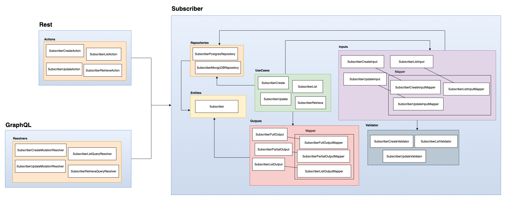

# PHP Architecture Proposal

The purpose of this repository is to define the architecture at the level of separation of responsibilities and communication of each layer within the module.

### Bounded Context, Module, Folder or Whatever.

I prefer Bounded Context, and this 'folder' is a grouped logic of related classes with the same goal.

Basically, the responsibility is create boundaries to avoid put all business rules at same place.

## Use Case

Here we are using the Use Case concept from Clean Architecture, that used to define the input, output, and internal flow we want to do.

#### Why Use Case nomenclature instead Service

At many projects everything it's a service even for business rules and this makes us think these services can be used and reused wrong way.

The problem is, when you have a service that is responsible to create a subscriber, that's okay, but when a new use case is inserted as create a subscriber and send email, what's is the first thing thats comming you mind? Create a new service? Or pass a param `$sendEmail = true` or event create a new method `createAndSendEmail` and pass the param to be verified on the code if should or not send the email.

Many of us think that pass a param or event create a new method on the service with the named `createAndSendEmail` it's easy, and it is, but maybe in the future more and more flags can be passed to the service, an that's way so bad as design.   

and the nomenclature makes more sense when we are talking about business logic 

## Input and Output

Input and Output, both are DTOs, that we use as use case param and return.

These DTO's can be used by Rest, GraphQL, Cli applications to communicate directly with the domain.

#### Why use DTO's?

* Use classes or interfaces as contract, creating a specific type for specific use case, otherwise array do not guarantee the type neither structure
* Is reusable, we can have a DTO with a property that can be another DTO
* Is type-safe
* Allow external libraries to connect using Annotations or Attributes
* Can have some logic